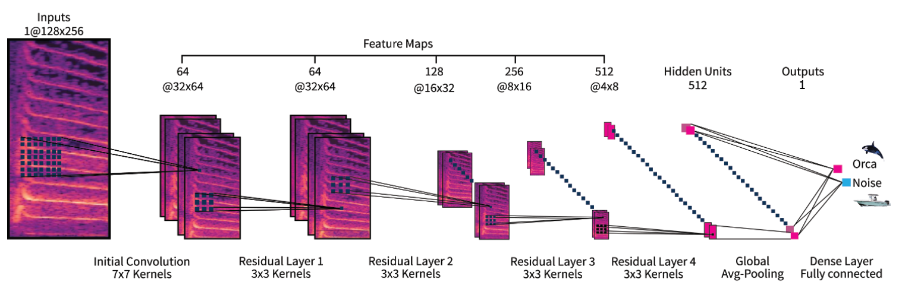
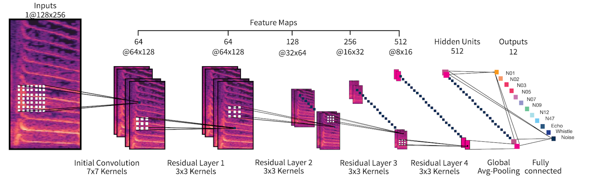
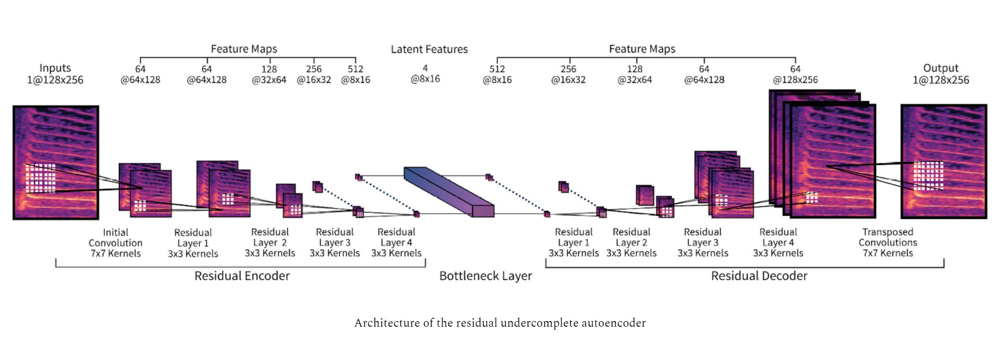
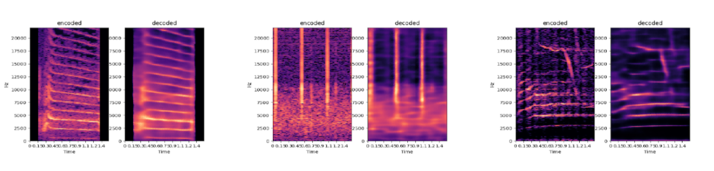

Consists of two classifiers, one that handles binary classification and another one multi-classification, both are based on a ResNet18 architecture. Both models are optimized to detect orca vocalizations, however, it is possible to use both models to experiment with classifying other animal vocalizations. You can choose to either apply mel compression or linear compression on the audio samples.

All experiments were built using Keras, python3, and libraries such as Pandas, sci-kit learn, and Numpy.

## Binary Classifier

##### ResNet18:
* Without max-pooling in the first residual layer.
* Kernel size 7 with stride 2 in the first residual layer
* Global average pooling performed on the bottleneck training features (512 feature maps and 4 x 8 hidden units)
* Sigmoid activation function in the last Dense layer
* One output result either Orca or Noise.
* Adam optimizer with initial learning rate 10e-5, beta 1 = 0.5, and beta 2 = 0.999
* Binary cross-entropy loss function

The learning rate automatically decreased by a factor of 0.5 if there was no improvement in the validation accuracy after 4 epochs and the training would stop if there was no improvement in the validation accuracy after 10 epochs.

## Multi Classifier

The multi classifier is pretty much similar to the Binary classifier with a few changes. You can choose the number of outputs and instead of a Sigmoid activation function in the last Dense layer it contains a Softmax activation function. Furthermore, the dimensions in the last Dense layer is 512 x 8 x 16 instead of 512 x 4 x 8 in the last Dense layer of the Binary classifier.

Furthermore, it is possible to use the weights of the Autoencoder's encoder part for weight initialization.

## Running the classifiers

The classifiers are optimized to run on a Linux terminal. To train the model run the main script. To run predictions run the predict script. To get the preciscion, recall, and f1 score, and to plot the confusion matrix and ROC curve simply run the metrics script.

On the top of each script you can see which arguments you can add on the terminal and which arguments are required to use.

To run:
e.g. main:
python3 main.py --data-dir /mnt/c/myProjects/THESIS/csv/ORCASPOT_csv/ --res-dir /results/ --model /model.h5 --initial-epoch 7 --freq-compress linear

e.g. predict:
python3 predict.py --data-dir /mnt/c/myProjects/THESIS/csv/ORCASPOT_csv/ --res-dir /results/ --freq-compress linear

Required arguments:
- --data-dir -> path of your data
- --res-dir -> path of where you want to store the results.

## Autoencoder

Because we had 512 samples of labeled data for our multi-classifier experiment, we trained an autoencoder and used its weight for weight initialization for the multi-classifier. The architecture is based on the ResNet18 architecture of the multi-classifier.

Like in the ResNet18 architectures we used in the previous experiments, we omitted max-pooling before the first residual layer to process the data with a high resolution as long as possible. But different from the previous ResNet18 architecture, the size of the strides in the first convolution layer of the first residual layer was 1 and not 2 as we did in the previous experiment. This resulted in a layer size of 8 x 16 x 512 instead of 4 x 8 x 512 in the last residual layer.

For the bottleneck layer, we used a convolution layer with kernel size 1, strides size 1, and a filter size of 4. This compressed the 512 channels to 8 x 16 x 4. Another convolution layer with kernel size 1, strides size 1, and filter size 512, was then used to compress the 4 channels back to 8 x 16 x 512.
Furthermore, we experimented with setting the stride size in the first convolution layer of the first residual layer to 2, such that the dimensions in the bottleneck layer would be reduced to 4 x 8 x 4. But this resulted in too much loss of the resolution, which prevented the decoder to properly learn the data features. Thus, we kept the strides in the first convolution layer of the first residual layer to 1.

For the decoder, we utilized transposed convolutional layers for upsampling. The decoder differs slightly from the encoder. In the decoder, we did not use stride size 1 in the last layer of the last residual layer but stride size 2. This resulted in a last residual layer size of  128 x 256 x 64. A final transposed convolution layer with kernel size 7, strides 1, and filter size 1, turned the final output layer to size 128 x 256 x 1. A sigmoid activation function was then applied to the final layer.

#### AE Results

